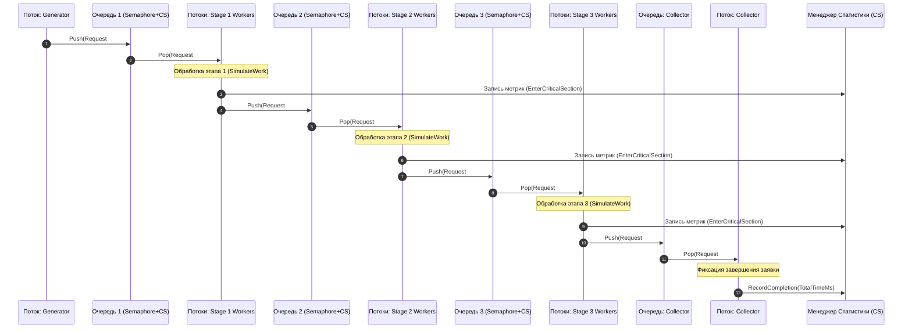

```mermaid

sequenceDiagram
    autonumber
    participant Gen as Поток: Generator
    participant Q1 as Очередь 1 (Semaphore+CS)
    participant St1 as Потоки: Stage 1 Workers
    participant Q2 as Очередь 2 (Semaphore+CS)
    participant St2 as Потоки: Stage 2 Workers
    participant Q3 as Очередь 3 (Semaphore+CS)
    participant St3 as Потоки: Stage 3 Workers
    participant QC as Очередь: Collector
    participant Col as Поток: Collector
    participant Stats as Менеджер Статистики (CS)

    Gen->>Q1: Push(Request #N) [ReleaseSemaphore]
    Q1->>St1: Pop(Request #N) [WaitForSingleObject]
    Note over St1: Обработка этапа 1 (SimulateWork)
    St1->>Stats: Запись метрик (EnterCriticalSection)
    St1->>Q2: Push(Request #N)
    
    Q2->>St2: Pop(Request #N)
    Note over St2: Обработка этапа 2 (SimulateWork)
    St2->>Stats: Запись метрик (EnterCriticalSection)
    St2->>Q3: Push(Request #N)

    Q3->>St3: Pop(Request #N)
    Note over St3: Обработка этапа 3 (SimulateWork)
    St3->>Stats: Запись метрик (EnterCriticalSection)
    St3->>QC: Push(Request #N)

    QC->>Col: Pop(Request #N)
    Note over Col: Фиксация завершения заявки
    Col->>Stats: RecordCompletion(TotalTimeMs)

```